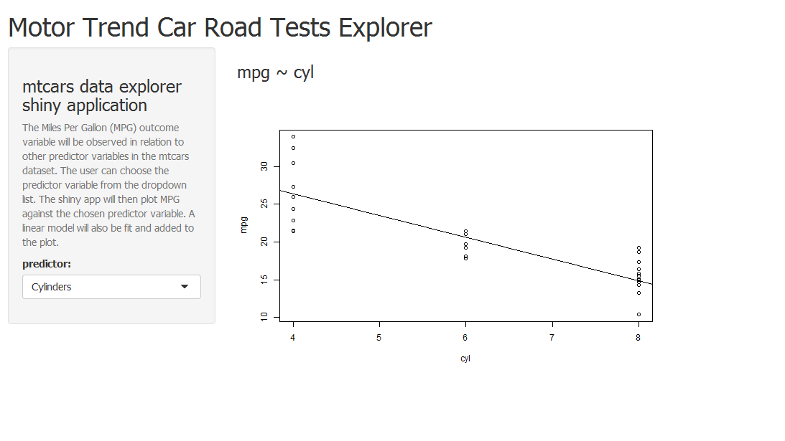

## Purpose and Objective

This shiny app created as part of the peer assessment for the  Developing Data Products class and displayes  the user manual for the app as well. The course project has two skills to be mastered which are: 

- 
shiny to build data product application

- 
R-Presentation or slidify to create data product related presentations


---

## Motor Trend Car Road Tests Explorer

You can explore the mtcars data with this shiny application  and also do simple linear regression modelling in predicting Miles Per Gallon (MPG) against any of the other variables.


- 
The Miles Per Gallon (MPG) outcome variable will be observed in relation to other predictor variables in the mtcars dataset.
- 
The user can choose the predictor variable from the dropdown list. 
- 
The shiny app will then plot MPG against the chosen predictor variable. 
- 
A linear model will also be fit and added to the plot.


The application can be accessed at the following URL: 

- 
https://chandru1102.shinyapps.io/My_App


---

## How to use the App

Below is a screenshot of the app. The user can choose one of the predictor variables and change the plot of MPG versus the chosen variable and also see the fitted linear regression model.

 </img>

---

## Underlying Code

Here's some R code from the application:

```{r}

library(datasets)

df <- mtcars
df$am <- factor(df$am, labels = c("Automatic", "Manual"))

plot(mpg ~ wt, data = df)
fit <- lm(mpg ~ wt, data = mtcars)
abline(fit)


```


